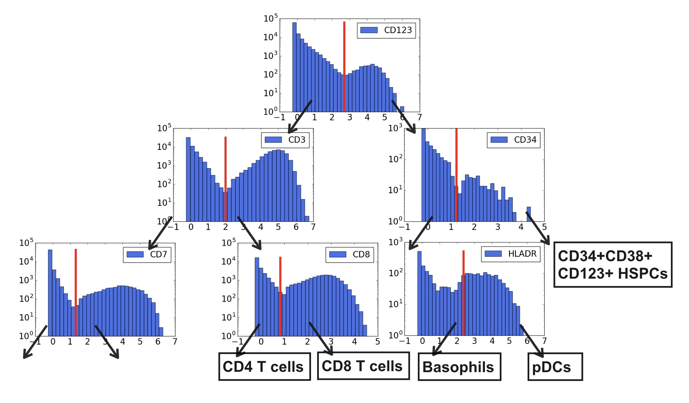

# fc_mondrian

This repository contains an implementation of automated gating algorithms with Mondrian processes for flow cytometry data described in our paper: 
[Bayesian Trees for Automated Cytometry Data Analysis](http://proceedings.mlr.press/v85/ji18a/ji18a.pdf)
(Disi Ji, Eric Nalisnick , Yu Qian, Richard H. Scheuermann, and Padhraic Smyth)

## Introduction
We develop a novel Bayesian approach for automated gating that
classifies cells into different types by combining cell-level marker measurements with an informative prior. The Bayesian approach allows for the incorporation of biologically-meaningful prior
information that captures the domain expertise of human experts. The inference algorithm results in a hierarchically-structured classification of individual cells in a manner that mimics the
tree-structured recursive process of manual gating, making the results readily interpretable.

  

## Publication
If you use this repository in your research, please cite the following paper:

_"Bayesian Trees for Automated Cytometry Data Analysis"_ ([PDF](http://proceedings.mlr.press/v85/ji18a)).

    @inproceedings{ji2018bayesian,
      title={Bayesian Trees for Automated Cytometry Data Analysis},
      author={Ji, Disi and Nalisnick, Eric and Qian, Yu and Scheuermann, Richard H and Smyth, Padhraic},
      booktitle={Machine Learning for Healthcare Conference},
      pages={465--483},
      year={2018}
    }

## License and Contact

This work is released under the MIT License.
Please submit an [issue](https://github.com/disiji/fc_mondrian/issues/new) to report bugs or request changes. 
Contact **Disi Ji** [:envelope:](mailto:disij@uci.edu) for any questions or comments. 

## Acknowledgments
This work was supported in part by the National Center For Advancing Translational Sciences of
the National Institutes of Health [U01TR001801]; and by the National Science Foundation [IIS1320527]. The content is solely the responsibility of the authors and does not necessarily represent
the official views of the National Institutes of Health or the National Science Foundation.
